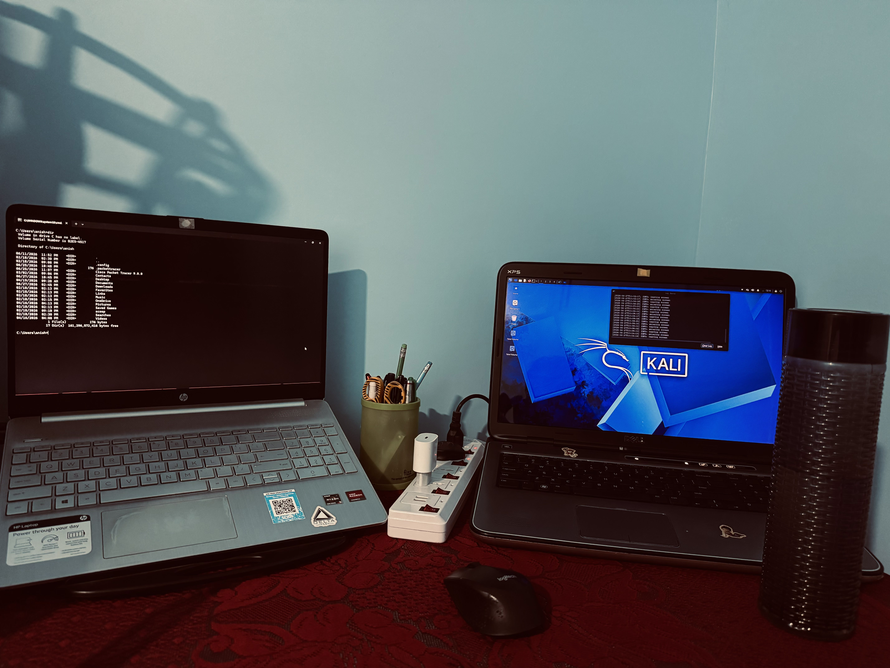
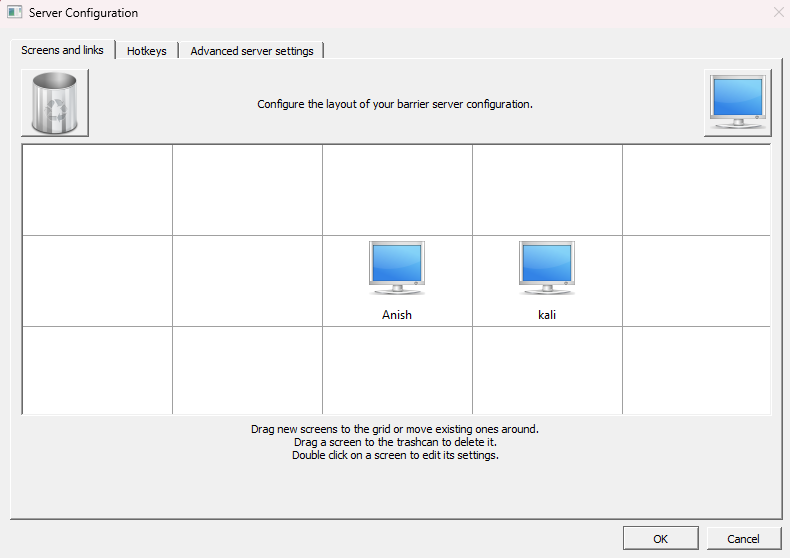
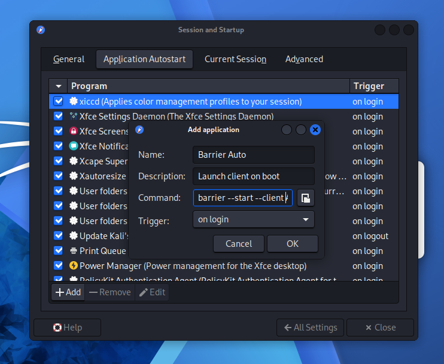
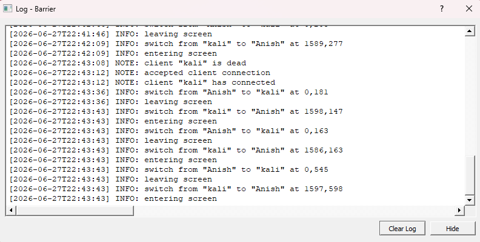
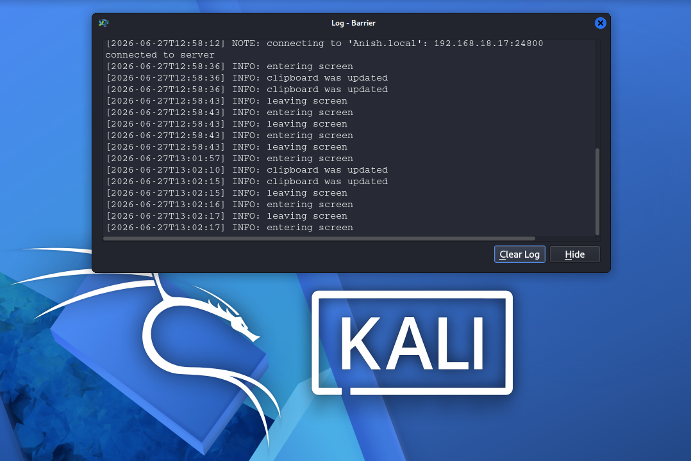

# One Keyboard, One Mouse, Two Operating Systems: Windows 11 + Bare-Metal Kali Linux KVM Setup

A step-by-step guide to sharing a single keyboard, mouse, and clipboard across a Windows 11 laptop and a bare-metal Kali Linux laptop, using the open-source KVM tool **Barrier** — including every roadblock I hit along the way and exactly how I fixed each one.



---

## 📋 Table of Contents

- [Why This Exists](#why-this-exists)
- [A Note on Barrier's Maintenance Status](#a-note-on-barriers-maintenance-status)
- [Why Barrier instead of Input Leap?](why-barrier-instead-of-Input-Leap?)
- [System Architecture](#system-architecture)
- [Prerequisites](#prerequisites)
- [Phase 1: Windows 11 Server Setup](#phase-1-windows-11-server-setup)
- [Phase 2: Kali Linux Client Setup](#phase-2-kali-linux-client-setup)
- [Phase 3: Display & Network Fixes](#phase-3-display--network-fixes)
- [Phase 4: Zero-Touch Boot Automation](#phase-4-zero-touch-boot-automation)
- [Verifying Everything Works](#verifying-everything-works)
- [Troubleshooting Quick Reference](#troubleshooting-quick-reference)
- [Lessons Learned](#lessons-learned)
- [Credits & Further Reading](#credits--further-reading)

---

## Why This Exists

Running two laptops side by side for a home lab is great, until you end up with two keyboards, two mice, and a desk full of cables. I wanted one keyboard and mouse that could control both machines seamlessly — my daily-driver **Windows 11 HP laptop**, and an older **Dell laptop running Kali Linux bare-metal** for cybersecurity study.

The tool that makes this possible is **Barrier**, a free, open-source "software KVM" — it shares your keyboard, mouse, and clipboard across machines over your local network, with no extra hardware needed. The concept is simple, but getting two completely different operating systems to cooperate took some real troubleshooting. This README documents that process so you (or future me) don't have to repeat it from scratch.

---

##  A Note on Barrier's Maintenance Status 
⚠️
Before you start: **Barrier is no longer actively maintained.** Its last release was in 2021, and the original developers have moved to a fork called **[Input Leap](https://github.com/input-leap/input-leap)**, which continues to receive updates and bug fixes.

This guide documents Barrier specifically, since that's what I used and tested. It still works fine for this setup. But if you run into a wall Barrier can't get past, or if you're starting fresh and want something actively maintained, Input Leap uses a very similar setup process and is worth trying first. I ran into some troubleshooting issue with Input Leap so i move towards Barrier.

---
## Why Barrier instead of Input Leap?
While Input Leap is the active open-source successor to Barrier, it is currently undergoing a major structural rewrite and remains in a volatile development phase. For a rock-solid home lab, Barrier is the superior choice because it is battle-tested, doesn't suffer from breaking alpha bugs, and is available as a native pre-compiled package directly in the Kali Linux upstream repositories (apt). It delivers the exact clipboard sharing and KVM features needed without the headache of troubleshooting an unstable tool.

---
## System Architecture

| Role | Machine | OS | Function |
|---|---|---|---|
| **Server** | HP Laptop | Windows 11 | Holds the physical keyboard & mouse |
| **Client** | Dell Laptop | Kali Linux (bare-metal, XFCE desktop) | Receives keyboard/mouse input over the network |

In Barrier's terminology, the **Server** is whichever machine has the physical keyboard and mouse plugged into it. The **Client** is the machine that "borrows" that input over your local network. Moving your mouse cursor off the edge of one screen sends it seamlessly onto the other.


---

## Prerequisites

- Both laptops connected to the **same local network** (same Wi-Fi router or switch)
- Windows 11 already installed on the HP laptop
- Kali Linux already installed bare-metal (not in a VM) on the Dell laptop, with the XFCE desktop
- Basic comfort opening a terminal on Linux and Settings on Windows

---

## Phase 1: Windows 11 Server Setup

The Server is the machine with the physical keyboard and mouse — in this case, the HP laptop.

1. Download the official Windows installer (`.exe`) from [Barrier's GitHub releases](https://github.com/debauchee/barrier/releases). For my setup I downloaded from [SourceForge](https://sourceforge.net/projects/barrier.mirror/).
2. Run the installer and accept the default options.
3. Open Barrier, and select **Server (share this computer's mouse and keyboard)**.
4. Note your Windows machine's name: go to **Settings → System → About** and check the **Device name** field. (Mine is `Anish` — you'll need yours for the client setup later.)
5. Click **Configure Server**. You'll see a grid representing screen positions:
   - Drag a new screen icon into the grid.
   - Double-click it and type in your Kali machine's hostname exactly (e.g. `kali`).
   - Position it on the grid to match where it physically sits on your desk (left/right of your Windows screen).
6. Click **OK**, then **Start** to begin running the server.



---

## Phase 2: Kali Linux Client Setup

The Client is the machine that receives keyboard and mouse input — the Dell laptop running Kali.

### Step 1: Install Barrier natively (not via Flatpak)

If you install Barrier through Flatpak, it'll launch and even detect the network — but the mouse and keyboard input won't actually pass through. This is because Flatpak apps run in a sandbox that, by default, restricts the kind of low-level system access Barrier needs to simulate mouse and keyboard input across your whole desktop. That sandboxing exists for good security reasons in general, but it breaks Barrier's core function here.

The fix is to skip Flatpak and install the native package instead:

```bash
sudo apt update
sudo apt install barrier -y
```

### Step 2: Fix the frozen mouse cursor (X11 permissions)

After installing natively, you may find your keyboard works across both machines, but the mouse cursor freezes the instant it crosses onto the Kali screen. This happens because Kali's X11 display server (the system that manages your screen, mouse, and keyboard on Linux) blocks external input sources from controlling the cursor by default — a sensible default that gets in Barrier's way here.

The fix:

```bash
xhost +
```

> ⚠️ **Security note:** `xhost +` doesn't just allow Barrier through — it disables X11's access control **entirely**, meaning any process that can reach your X server could potentially send it input. On a security-focused machine like a Kali box, that's worth knowing rather than copy-pasting blindly. A couple of safer options if you want to tighten this up:
> - Run `xhost -` afterward to restore the default protection once you're done with your Barrier session.
> - Look into scoping the permission more narrowly (e.g. to a specific user or host) instead of opening it globally, if you want this to be a permanent setup rather than something you toggle on/off.

---

## Phase 3: Display & Network Fixes

Two more issues showed up once the basic connection was working.

### Fix 1: Windows display scaling breaks the cursor

Barrier tracks your mouse position using raw pixel coordinates to know where the cursor is on each screen. Windows' fractional display scaling (commonly 125% on modern laptop screens) changes how those pixel coordinates get reported to other applications, which throws off Barrier's math — the cursor gets stuck at the top-left corner (0,0) the moment it crosses onto the other screen.

**The fix:** keep Windows display scaling at exactly **100%**. Since 100% scaling can make text uncomfortably small on a high-resolution screen, instead of using scaling to compensate, lower the actual screen resolution one step (e.g., to 1600×900). This keeps text readable while keeping Barrier's pixel math accurate.

### Fix 2: IP addresses keep changing

Most home routers reassign local IP addresses periodically (via DHCP), which breaks a setup that relies on typing a fixed IP like `192.168.x.x` — it'll work today and fail in a few days.

**The fix:** use hostname-based discovery (mDNS) instead of IP addresses, so the connection survives IP changes.

On the **Kali** side, install and enable `avahi-daemon` (the standard Linux mDNS service):

```bash
sudo systemctl enable avahi-daemon
sudo systemctl start avahi-daemon
```

Windows 11 already has mDNS support built in by default on private networks — no extra install needed there. Once avahi is running on Kali, you can reach your Windows machine using its hostname plus `.local` instead of an IP address:

```bash
ping Anish.local -c 3
```

*(Replace `Anish` with your own Windows device name from Phase 1, Step 4.)*

If this doesn't resolve, double check your Windows network is set to **Private** (not Public) — Windows restricts mDNS responses on public network profiles by default.

---

## Phase 4: Zero-Touch Boot Automation

Once everything works manually, the last step is making it start automatically on both machines so you never have to launch it by hand.

### Windows side

1. Press `Win + R`, type `shell:startup`, and press Enter — this opens the Windows Startup folder.
2. Create a shortcut to Barrier and place it inside this folder.
3. Open Barrier's settings and make sure **Minimize to system tray** and **Hide on startup** are both checked. This way it launches silently in the background on login.

### Kali (XFCE) side

1. Open **Application Menu → Settings → Session and Startup**.
2. Go to the **Application Autostart** tab and click **+ Add**.
3. Fill in:
   - **Name:** Barrier Auto
   - **Command:** `barrier --start`
   - **Trigger:** on login
4. Click **OK** and confirm the new entry is checked/enabled.



---

## Verifying Everything Works

After restarting both machines and logging in:

- Move your mouse off the edge of the Windows screen — it should appear on the Kali screen without any extra clicks.
- Type something — keyboard input should follow the cursor to whichever screen it's on.
- Copy text on one machine, paste on the other — clipboard sharing should work both directions.
- On Kali, confirm Barrier is actually running in the background:

```bash
ps aux | grep barrier
```

---

## Troubleshooting Quick Reference

| Symptom | Cause | Fix |
|---|---|---|
| Mouse/keyboard don't connect at all | Used Flatpak version on Kali | Reinstall via `sudo apt install barrier` |
| Keyboard works, mouse freezes at the screen edge | Kali's X11 blocking external input | `xhost +` (see security note above) |
| Cursor jumps to (0,0) and gets stuck | Windows display scaling above 100% | Set scaling to 100%, lower resolution instead |
| Setup works, then breaks after a few days | Router changed the local IP via DHCP | Use `avahi-daemon` + `.local` hostname instead of IP |
| `ping hostname.local` fails from Kali | Windows network set to Public, or mDNS blocked | Set Windows network profile to Private |
| Barrier doesn't launch on startup | Autostart not configured | Re-check Phase 4 steps on the relevant OS |

---

## Lessons Learned

- Always install Linux GUI tools that need deep system access (input control, in this case) via native packages rather than Flatpak/Snap, unless you've confirmed the sandboxed version explicitly supports it.
- Any fix that says "disable a security feature" (like `xhost +`) is worth pausing on — even when it's the quickest path to "it works now," understand what you're turning off and whether it should stay off permanently.
- Hostname-based networking (mDNS/`.local`) is far more durable than hardcoding IP addresses for anything that needs to survive a home network for more than a few days.

---

## Credits & Further Reading

- [Barrier (debauchee/barrier)](https://sourceforge.net/projects/barrier.mirror/) — the tool used in this guide, but I downloaded .exe file from [SourceForge](https://sourceforge.net/projects/barrier.mirror/)
- [Input Leap](https://github.com/input-leap/input-leap) — the actively maintained successor to Barrier
- Maintained by **Anish Jha**

  ---




